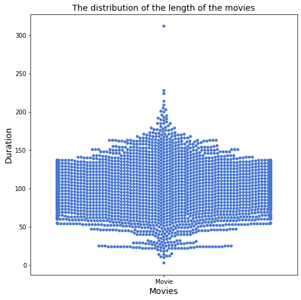

## Exploratory Data Analysis (EDA) on Netflix Movies and TV Shows
**Saiful Hasan [LinkedIn](https://www.linkedin.com/in/saifulhasan22/)**

Recently, from Kaggle, I have got a large dataset that consists of tv shows and movies available on Netflix as of 2019. The dataset was collected from a third-party Netflix engine called Flixable. The dataset was released in 2018 in an exciting report that presented the number of TV shows on Netflix has nearly tripled since 2010 ([Shivam Bansal](#https://www.kaggle.com/shivamb/netflix-shows)).I did some preliminary exploratory data analysis (EDA) with a curiosity to derive some insights from this data. EDA is a critical approach to perform an initial investigation on the dataset. We, data scientists and researchers, conduct EDA to summarize the data's main characteristics and discover the pattern and methodologies. EDA helps us to explore what our data could tell us beyond the formal modeling or hypothesis testing task. It is a common approach to use visual methods in EDA to represent insights because it is considered more interpretable to both technical and non-technical audiences. 

We have data of 6234 Netflix contents. The data inlcuded information related to the 1) program type, 2) title of the program, 3) director name, 4) cast name, 5) country where the program were produced, 6) inclusion date on Netflix, 7) actual relase date of the program, 8) duration of the program, 9) program rating, 10) the category where the program were listed and 11) the short descriptions of the program.

### Exploratory Data Analysis 

**The Pie chart indicates that between 2010 and 2019, around 68.4% of all the contents on Netflix were movies. Compared to it, TV Shows consisted of only 31.6% of the contents. It implies that movie contents have been dominating over TV shows on Netflix over the last decade.** 

**This Pie chart indicates that TV-MA and TV 14 are the two top ratings among a total of 14 ratings. All 14 ratings are TV-MA, TV-14, TV-PG, R, PG-13, NR, PG, TV-Y7, TV-G, TV-Y, TV-Y7-FV, G, UR, NC-17. Over the decades, around 2027, 1698, 701 contents were labeled TV-MA, TV 14, and TV-PG. According to TV parental guideline, TV-MA stands for Mature Audience - indicating the content is specifically designed to be viewed by adults and therefore may be unsuitable for children under 17. In contrast, programs rated TV-14 contain material that parents or adult guardians may find inappropriate for children under 14.**

**This chart suggests that most of the movies added to Netflix are produced in the United States, followed by India. This chart shows only the top 15 countries. As of 2019, around 1,900 American movies were added to Netflix, whereas 738 Indian movies were present on Netflix. Except for the US, India, South Korea, China, the UK, Bulgaria, Spain, all other countries have less than 100 movies on Netflix. There are movies from around 107 countries added to Netflix since 2010.**

**This chart suggests that most of the TV shows added to Netflix are produced in the United States, followed by United Kindom. This chart shows only the top 15 countries. In contrast to movies, for TV shows, India stands at 8th position. there were around 700 American TV shows added to Netflix compare to only 223 UK based TV shows since 2010.**

**We observed an increased number of TV shows produced in the United States added to Netflix over the decade. This is also helpful to explain why the US stands top in the total number of TV shows on Netflix. We observed that most of the American TV shows added to Netflix were released between 2014-2019.**

**Interestingly, the number of movies per country is declining for almost all countries after around 2016-2017. The reason could be that Netflix is now more focusing on TV shows than movies.**

**This distribution graph shows that most of the movies on Netflix have a duration of around 100 minutes. The exact average duration is 99 minutes for movies, which is approximately 1 hour and 40 minutes.**

**We observed that most of the TV shows listed on Netflix have around 1-2 seasons. A few of them have above five seasons as well.**

**This graph shows the changes in the duration of movies over the years and we can see that movies in 1940 had lower duration compared to recent movies. There were also movies with duration below 1 hour and above 3 hours. However, from around the 1970s, most movies have a duration between  1.5 hrs and 2 hrs.**

**we don't have list of directors of all the Netflix programs since 2009. We had missing values for around 1969 directors. We have a list of directors for about 4265 Netflix programs. However, this above list shows the top 15 directors with the highest number of movies added on Netflix over the last decade, and we see that Jan Suter stands top in the list, followed by director Rail Campos.**

#### Data Reference:
This data was collected from kaggle. The link is given below:
- [Kaggle Link](#https://www.kaggle.com/leonardopena/top-spotify-songs-from-20102019-by-year)
- the data was uploaded by Shivam Bansal on Kaggle 